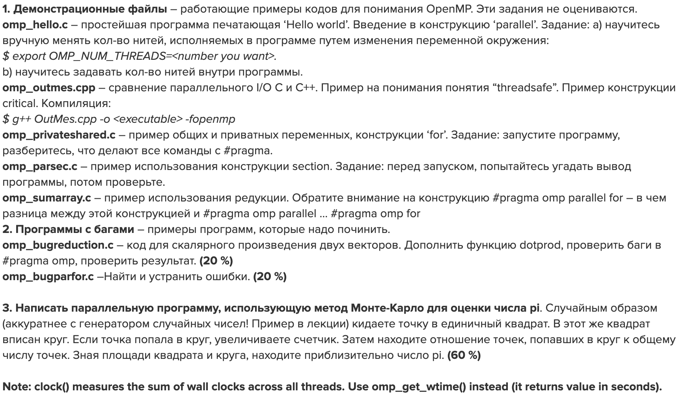

## HW3: OpenMP
Demo files are in [demo](demo/)

Fixed bug programs are in [bug_fixes](bug_fixes/)

Monte-Carlo Pi Estimation script is in [pi_estimate](pi_estimate/).

To compile & run: ```gcc-11 -fopenmp omp_pi_estimate.c -o pi.o && ./pi.o >res.txt ```



